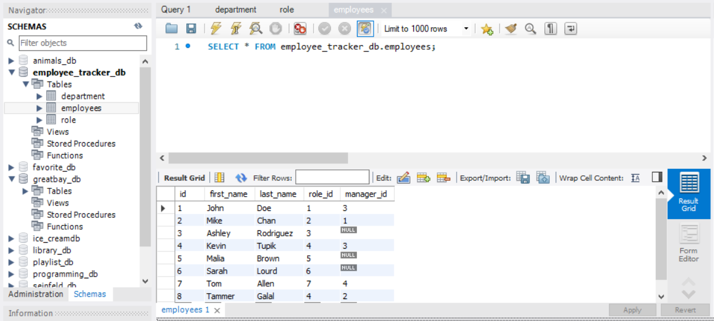
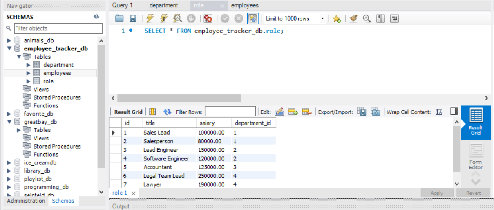
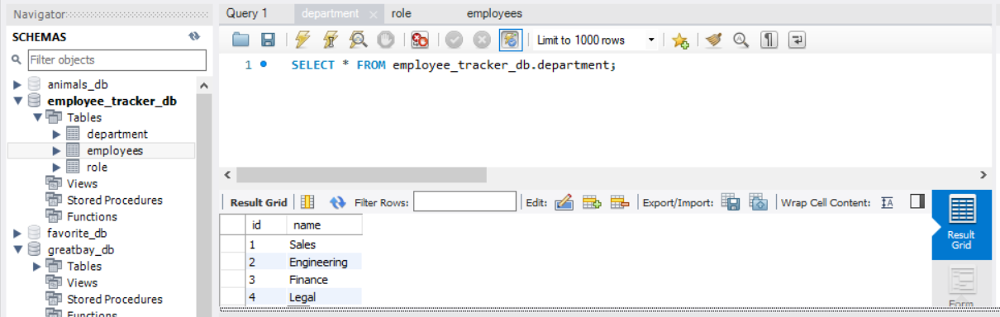

# Employee Tracker

The Employee Tracker was built for a business owner who wants to be able to view and manage the departments, roles, and employees in their company for organization and planning purposes.

 

## Coding Process

This command-line application allows the user to:

* Add departments, roles, employees

* View departments, roles, employees

* Update employee roles

 

This application was created with:

* MySQL NPM package to connect to MySQL database and perform queries

* InquirerJs NPM package to interact with the user via the command-line

* console.table NPM to print MySQL rows to the console

 

 

 

 

To view the demo link, please navigate to the **Demo Link** below or  [click here](https://drive.google.com/file/d/1r9LA72u7k9CZtzqO8hEGj5Vmmm3qrrkp/view) to view.

 

## Powered By

* [Javascript](https://developer.mozilla.org/en-US/docs/Web/JavaScript)
* [Node.js](https://nodejs.org/en/)
* [npm install](https://nodejs.org/en/)
* [inquirer nodejs](https://www.npmjs.com/package/inquirer)
* [console.table nodejs](https://www.npmjs.com/package/console.table)
* [MySQL](https://www.mysql.com/)

 

### Other Resources Used

* [Visual Studio Code](https://code.visualstudio.com/)
    * [How to install VS Code](https://code.visualstudio.com/docs/setup/setup-overview)
* [GitBash](https://gitforwindows.org/)
    * [Download GitBash for Windows](https://git-scm.com/downloads)

 

## Demo Link

* [See Deployed Link](https://drive.google.com/file/d/1r9LA72u7k9CZtzqO8hEGj5Vmmm3qrrkp/view)

 

## Author
**Christy Lee** 

- [Github](https://github.com/christyglee)
- [LinkedIn](https://www.linkedin.com/in/christy-g-lee/)

  

## Acknowledgments

* [Google-Fu](https://www.google.com)
* [w3schools](https://www.w3schools.com/)
* [Stack Overflow](https://stackoverflow.com/search?q=over)
* [Node.js](https://nodejs.org/en/)
* [npm install](https://nodejs.org/en/)
* [MySQL](https://www.mysql.com/)
